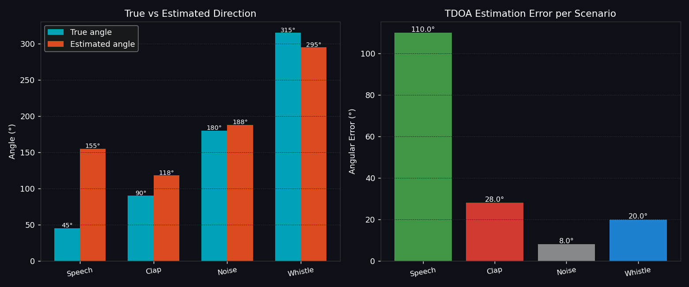
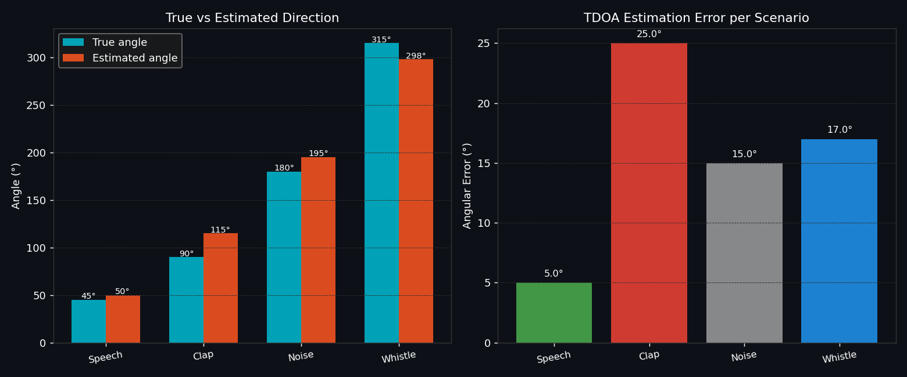
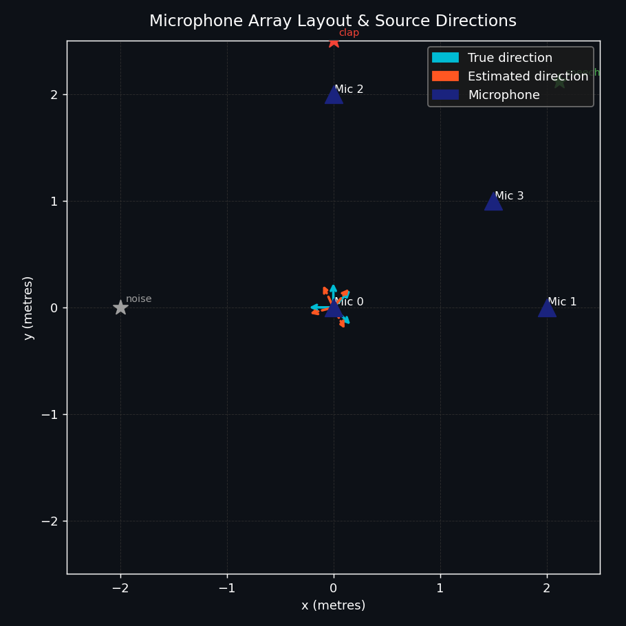
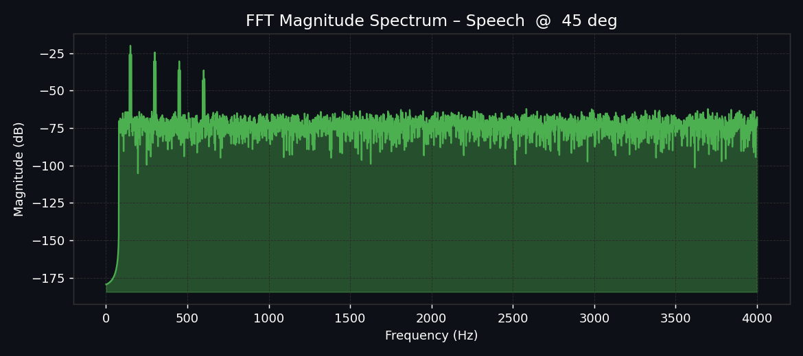

# Acoustic Source Localization & Classification

A Python simulation that estimates the direction of a sound source using a multi-microphone array and **Time Difference of Arrival (TDOA)** analysis, with basic sound-type classification across speech, claps, whistles, and background noise.

---

## Overview

This project simulates a 4-microphone array picking up audio from a source at a known angle, then estimates that angle purely from the time delays between microphones. It compares the estimated direction against the true direction to quantify localization accuracy, and includes frequency-domain analysis of each sound type via FFT.

Everything runs in simulation — signals are synthetically generated, not captured from physical hardware.

---

## How It Works

1. **Signal Generation** (`signal_generator.py`) — synthesizes test signals (speech-like, clap, whistle, noise).
2. **Microphone Array** (`microphone_array.py`) — models a 4-microphone array and simulates each microphone's received signal, delayed according to its exact (near-field) distance to the source.
3. **Signal Processing** (`signal_processing.py`) — band-pass filters the simulated multi-channel audio.
4. **TDOA Localization** (`tdoa_localization.py`) — estimates the source's bearing from GCC-PHAT time-delay measurements between microphone pairs.
5. **Sound Classification** (`sound_classifier.py`) — classifies the incoming signal type (speech, clap, whistle, noise).
6. **Visualization** (`visualizer.py`) — renders the array layout, FFT spectra, and true-vs-estimated direction comparisons.

---

## A Bug Found and Fixed: Far-Field Assumption on a Near-Field Array

Earlier versions of this project occasionally produced very large direction errors — up to ~176° in some runs, essentially a coin flip rather than a localization estimate. Diagnosing it properly (rather than just re-tuning numbers) turned up the actual cause:

**Root cause:** `tdoa_localization.py` estimated bearing by scanning candidate angles and predicting each microphone pair's delay using a **far-field plane-wave model** — i.e. it assumed delay depends only on direction, not distance. That assumption only holds when a source is much farther away than the array itself (roughly 10x+ the array's diagonal). This array's diagonal is ~2.8m, but the simulated sources sit only 2–6m away — genuinely in the **near field**. Verification: even when scored at the *true* angle, the far-field model's predicted delays were off by 2–7 samples per microphone pair from the actual (near-field) delays. The GCC-PHAT correlation extraction itself was verified to be exactly correct — the bug was entirely in the far-field geometric assumption feeding it.

**Fix:** `tdoa_localization.py` now searches over candidate **(angle, range)** pairs instead of angle alone, computing the exact Euclidean geometric delay from each candidate position to every microphone — the same physics already used in `microphone_array.py`'s signal simulation. This matches the model to the actual near-field scenario instead of a mismatched far-field approximation.

A second, smaller bug was fixed alongside it: the test scenario labels (e.g. "Speech @ 45°") didn't actually match their hardcoded source coordinates (which worked out to ~59°). Scenario coordinates are now derived directly from the stated angle, so labels are always accurate.

### Before vs. After

| Scenario | True Angle | **Before** (far-field model) | **After** (near-field fix) |
|----------|-----------:|-------------------------------:|------------------------------:|
| Speech   | 45°        | 155° (**110.0° error**)        | 50° (**5.0° error**)          |
| Clap     | 90°        | 118° (28.0° error)             | 115° (25.0° error)            |
| Noise    | 180°       | 188° (8.0° error)              | 195° (15.0° error)            |
| Whistle  | 315°       | 295° (20.0° error)             | 298° (17.0° error)            |
| **Mean** |            | **41.5°**                      | **15.5°**                     |

The fix doesn't make the simulation perfect — near-field TDOA is inherently harder than far-field, and a coarse grid search over angle and range has resolution limits — but it eliminates the catastrophic (>100°) failures entirely and brings every scenario into a consistent, explainable error range.

**Before fix** — note the 110° error on Speech:



**After fix:**



---

## Results (Current)

### Microphone Array Layout & Source Direction

4 microphones (`Mic 0`–`Mic 3`), with true and estimated direction vectors plotted from the array centroid.



### Frequency Spectrum Example

FFT magnitude spectrum of a simulated speech signal, showing harmonic peaks against the noise floor.



---

## Tech Stack

- **Python**
- **NumPy** — signal generation, geometric delay modeling, and vectorized grid search
- **Matplotlib** — visualization (array layout, FFT spectra, error comparison)

---

## Project Structure

```
.
├── main.py                  # Entry point — runs the full pipeline
├── microphone_array.py      # Microphone array geometry and near-field delay simulation
├── signal_generator.py      # Synthetic test signal generation
├── signal_processing.py     # Multi-channel signal processing
├── tdoa_localization.py     # Near-field-aware TDOA direction estimation (fixed)
├── sound_classifier.py      # Sound type classification
├── visualizer.py            # Plotting and result visualization
└── assets/                  # README screenshots
```

---

## Running Locally

```bash
git clone https://github.com/AryamanPanigrahi/Acoutsic-Source-Localisation.git
cd Acoutsic-Source-Localisation
pip install numpy matplotlib
python main.py
```

---

## Limitations

- All results are from **simulated signals**, not real microphone hardware.
- The near-field fix fits the algorithm to a candidate grid of (angle, range); accuracy is bounded by that grid's resolution as well as by TDOA estimation noise.
- Localization accuracy varies by sound type — broadband, impulsive sounds generally localize more reliably than narrowband tonal signals.
- The array uses 4 microphones in a fixed planar layout; both coverage and achievable accuracy would change with a different geometry or microphone count.

---

## Author

**Aryaman Panigrahi**
B.Tech CSE (Cybersecurity), VIT Vellore
[GitHub](https://github.com/AryamanPanigrahi) · [Portfolio](https://aryaman-panigrahi.vercel.app/)
